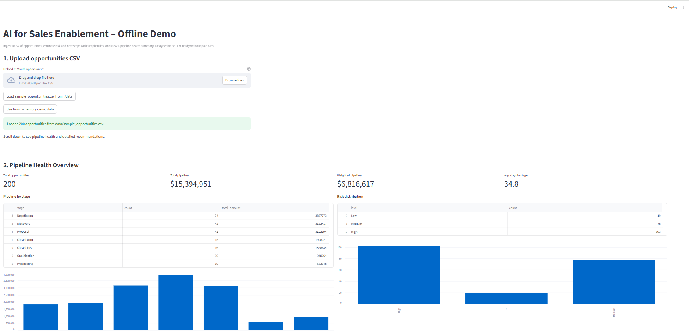
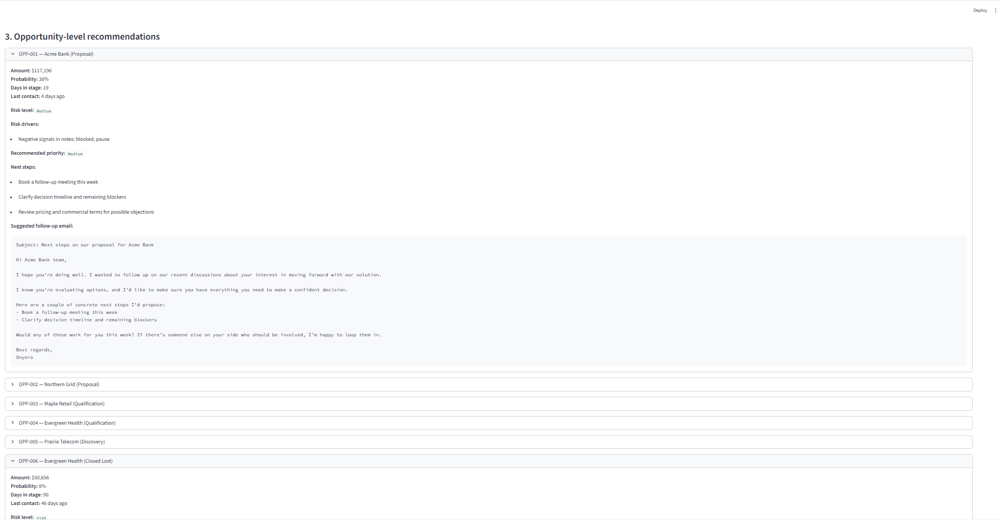

# AI for Sales Enablement – Offline Demo

Rule-based prototype of an **AI-assisted sales enablement tool** that ingests a CSV of opportunities and produces:

- Pipeline health KPIs  
- Simple risk scoring and next-step recommendations  
- Draft follow-up emails per opportunity  

It’s intentionally **LLM-ready** (RAG / summarisation / classification could drop in later), but uses **no paid APIs** – everything runs locally and deterministically.

---

## 🧩 What this demo shows

This project is designed to look and feel like the first iteration of an **AI sales pilot** you’d run inside a Client Engineering / presales team:

- **CSV ingestion** of sales opportunities  
- **Rule-based “AI” layer** that:
  - flags risk (stalled deals, budget issues, competitors, etc.)
  - suggests concrete next actions  
  - drafts a short follow-up email  
- **Pipeline health dashboard**:
  - Total pipeline / weighted pipeline
  - Average days in stage
  - Amount by stage
  - Risk distribution

---

## 📸 Screenshots

### Main dashboard

Shows CSV upload options, pipeline KPIs, stage breakdown, and risk distribution.



### Opportunity-level recommendation

Each opportunity expands to show risk explanation, recommended next steps, and a suggested email.



---

## 🗂 Project structure

```text
ai-sales-enablement-demo/
│   analytics.py              # KPIs, stage summaries, risk distribution
│   app.py                    # Streamlit UI
│   domain.py                 # Typed domain models (Opportunity, RiskAssessment, etc.)
│   generate_mock_data.py     # Synthetic data generator → data/sample_opportunities.csv
│   ingestion.py              # CSV reader → List[Opportunity]
│   README.md
│   requirements.txt
│   rules.py                  # Rule-based risk & recommendation engine
│
├── .dist/                    # (optional) distribution artifacts
├── .github/
│   └── workflows/
│       └── ci.yml            # GitHub Actions: tests + lint (if configured)
│
├── data/
│   └── sample_opportunities.csv   # Generated demo data
│
├── doc/
│   ├── demo.png              # UI screenshot
│   └── levelrecom.png        # Opportunity-level email screenshot
│
├── tests/
│   ├── test_analytics.py     # Unit tests for KPI logic
│   └── test_rules.py         # Unit tests for rules engine
│
└── __pycache__/              # Python bytecode (ignored in .gitignore)
```

---

## 🧪 Data model

### CSV schema

The app expects a CSV with the following columns:

| Column                  | Type   | Description                                               |
| ----------------------- | ------ | --------------------------------------------------------- |
| `id`                    | string | Deal / opportunity identifier (e.g. `OPP-001`)            |
| `account_name`          | string | Customer or account name                                  |
| `stage`                 | string | Sales stage (e.g. `Prospecting`, `Discovery`, `Proposal`) |
| `amount`                | number | Deal size (e.g. in USD/CAD)                               |
| `probability`           | float  | Win probability (0–1 or 0–100, auto-normalised)           |
| `days_in_stage`         | int    | How long the opportunity has been in this stage           |
| `last_contact_days_ago` | int    | Days since last contact                                   |
| `notes`                 | string | Free-text notes from CRM / call summary                   |

Example row:

```csv
id,account_name,stage,amount,probability,days_in_stage,last_contact_days_ago,notes
OPP-001,Acme Bank,Discovery,50000,0.4,10,5,"Client interested but concerned about integration timeline."
```

---

## 🧪 Synthetic data generator

To make the app demo-ready without real CRM data, you can generate a realistic sample CSV with:

```bash
python generate_mock_data.py
```

This will create:

```text
data/sample_opportunities.csv
```

with ~200 synthetic opportunities spanning different stages, probabilities, and a mix of positive/negative notes.
The notes intentionally include keywords like “budget”, “expensive”, “competitor”, “risk”, etc., so the risk rules have something to latch onto.

---

## 🚀 Getting started

### 1. Clone & set up environment

```bash
git clone <your-repo-url> ai-sales-enablement-demo
cd ai-sales-enablement-demo

# create a venv
python -m venv .venv
source .venv/bin/activate    # Windows: .venv\Scripts\activate

pip install -r requirements.txt
```

### 2. Generate demo data (optional but recommended)

```bash
python generate_mock_data.py
```

This populates `data/sample_opportunities.csv`.

### 3. Run the Streamlit app

```bash
streamlit run app.py
```

Then open the URL printed in the terminal (usually `http://localhost:8501`).

---

## 🖱 How to use the app

In the UI:

1. **Choose your data source**:

   * Upload your own CSV, or
   * Click **“Load sample_opportunities.csv from ./data”**, or
   * Click **“Use tiny in-memory demo data”** (small 4-row example)

2. Once loaded, the app will:

   * Parse the CSV
   * Build `Opportunity` objects
   * Run the rule engine to score risk & next steps
   * Generate a draft follow-up email per opportunity

3. Scroll down to see:

   * **Pipeline Health Overview** (total pipeline, weighted pipeline, average days in stage)
   * **Pipeline by stage** table and bar chart
   * **Risk distribution** across opportunities
   * **Opportunity-level recommendations** (expandable sections)

---

## 🧠 Rule-based “AI” layer

The intelligence is implemented in `rules.py` and `analytics.py`. It’s deliberately simple and transparent:

### Risk assessment (high level)

* **High risk** if:

  * Stage is early/mid, and
  * `days_in_stage` is high, or `last_contact_days_ago` is large, or
  * Notes contain negative keywords like:

    * `budget`, `expensive`, `delay`, `on hold`, `pause`, `competitor`, `blocked`, `risk`, `re-org`, etc.

* **Medium risk** if:

  * Some mild warning signals (e.g. long days in stage) but probability isn’t terrible.

* **Low risk** if:

  * Probability is decent and no strong risk signals were detected.

Each `RiskAssessment` includes:

* `level`: `"low" | "medium" | "high"`
* `reasons`: list of human-readable bullets explaining why.

### Recommended actions

Based on risk and stage, we produce:

* A **priority**: `"low" | "medium" | "high"`
* Concrete **next steps** like:

  * “Schedule follow-up with buying committee”
  * “Clarify budget and procurement timeline”
  * “Address competitor comparison explicitly in next call”

### Suggested email

For each opportunity we build a **short, structured email**:

* Subject: e.g. `Checking in on our proposal for Acme Bank`
* Body: a few paragraphs referencing:

  * Account name
  * Stage
  * Talk track around concerns / next actions

This is all template-based logic today, but the scaffolding is ready for LLM-driven generation.

---

## 📊 Analytics & KPIs

Implemented in `analytics.py`:

* **Basic KPIs**:

  * `total_opportunities`
  * `total_pipeline`
  * `weighted_pipeline` (sum of `amount * probability`)
  * `avg_days_in_stage`

* **Stage summary**:

  * Total amount per stage
  * Count of opportunities per stage

* **Risk distribution**:

  * Count of opportunities per risk level

These are surfaced via Streamlit metrics, tables, and bar charts.

---

## ✅ Tests & CI

Basic unit tests live in `tests/`:

* `test_rules.py` – checks risk scoring and recommendation logic on small, deterministic samples
* `test_analytics.py` – checks KPI calculations and aggregation behavior

To run tests locally:

```bash
pytest
```

A GitHub Actions workflow is included in `.github/workflows/ci.yml` and typically runs:

* `pip install -r requirements.txt`
* `pytest`

This makes the project feel more like a **real, production-minded codebase** rather than a one-off script.

---

## 🔮 Future extensions

* **LLM email generation**

  * Swap the template logic in `rules.py` with calls to an LLM (e.g. open-source model via Hugging Face or a hosted API).

* **RAG-style enrichment**

  * Pull in product docs, pricing sheets, or previous call transcripts to ground suggestions and reduce hallucinations.

* **More advanced scoring**

  * Train a simple classification/regression model on historical CRM data to predict win probability or risk.

* **Role-based views**

  * Add filters / toggles for “AE view”, “Manager view”, and “RevOps view”.

---